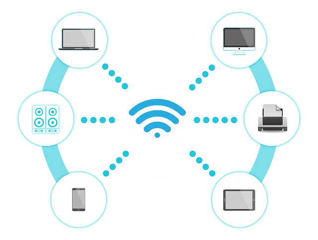

# JARINGAN NIRKABEL
## PENGERTIAN
Jaringan nirkabel adalah teknologi yang menggunakan dua piranti untuk bertukar data tanpa media kabel.Data dipertukarkan melalui media gelombang cahaya tertentu (seperti teknologi infrared pada remote TV) atau gelombong radio (seperti bluetooth pada ponsel dan komputer) dengan frekuensi tertentu. Prinsip dasar sebuah jaringan nirkabel sebenarnya sama dengan jaringan berkartu jaringan (Ethernet card). Fungsi access point atau biasa disingkat AP, pada sebuah jaringan nirkabel mirip dengan hub pada jaringan komputer berbasis kabel. Jika tanpa access point, komputer yang mempunyai adapter nirkabel dapat berkomunikasi langsung dengan komputer lainnya, dan hal ini sama dengan hubungan komputer ke komputer (peer-to-peer) dengan menggunakan kabel metode saling-silang (cross-over).  Contoh Penggunaan Teknologi Nirkabel : - Siaran Radio dan Televisi, Komunikasi Radar, Komunikasi Satelit, Infrared, WIFI, Bluetooth, Indikasi frekuensi radio.

